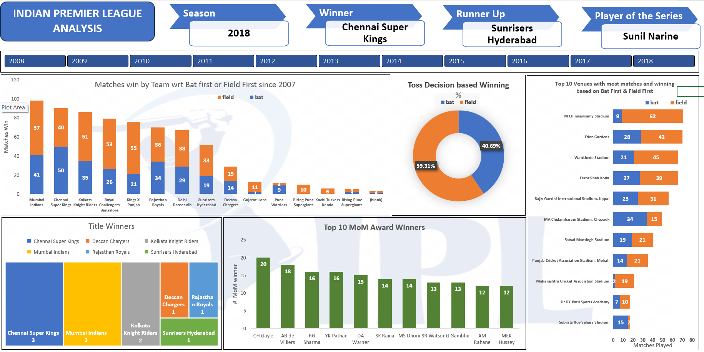

# IPL Analysis Dashboard
## Project Title: Indian Premier League (IPL) Analysis (2008-2018)
## Objective:
The goal of this project is to analyze IPL data from 2008 to 2018 to uncover insights about team performance, match outcomes, and key players. 
The dashboard provides a visual summary of major statistics and trends across IPL seasons.

If you have no time and need the overall insights, jump directly to the insights part!!
## Data Source:
Dataset collected from Kaggle (covering IPL matches from 2008 to 2018).
[Link text](https://www.kaggle.com/datasets/amberjain811/ipl-dataset-20082018)

## Tools Used: 
Microsoft Excel for data cleaning, analysis, and dashboard visualization.

## Key Performance Indicators (KPIs):
1. Season: Selected year (2008–2018)
2. Winner: Displays the winning team of the selected season
3. Runner Up: Displays the runner-up team of the selected season
4. Player of the Series: Highlights the standout player for the selected season
   

## Dashboard Interactivity:
→ The dashboard includes a year-wise filter (2008–2018).

→ All charts and KPIs dynamically update based on the year selected. This allows users to analyze trends, results, and performance for any specific IPL season within the 2008–2018 range.

## Dashboard Components:
### 1. Matches Won by Team (Bat First vs. Field First)
→ Displays total wins by each team, divided by whether they batted or fielded first.

→ Helps in identifying teams' preferred match strategies.
### 2. Toss Decision Based Winning Percentage
→ Shows the percentage of matches won based on toss decisions (batting or fielding first).

→ Indicates whether fielding or batting first was more advantageous in the selected year.
### 3. Top Venues with Most Matches and Wins
→ Lists venues with the highest number of matches played.

→ Compares wins based on batting or fielding first strategies at each stadium.
### 4. Title Winners Summary
→ Visual representation of total IPL titles won by each team from 2008 to 2018.

→ Adjusts based on the selected year to show cumulative title counts up to that season.
### 5. Top 10 "Man of the Match" Award Winners
→ Displays players with the most Man of the Match awards.

→ Helps identify consistent top performers across IPL seasons.

## Insights:

📌 Deep-Dive Insights from IPL Data Analysis

### 1. 🏆 Chennai Super Kings’ Legacy & 2018 Triumph

→ Chennai Super Kings (CSK) won the 2018 IPL title, further cementing their reputation as one of the most consistent teams in IPL history.

→ Under MS Dhoni's leadership, CSK has been known for its tactical adaptability and composed chases, making them a feared opponent.

→ The team has won 3 IPL titles (as of 2018), showcasing remarkable consistency in high-pressure games.
### 2. 🔥 Mumbai Indians – The Team to Beat
→ Mumbai Indians (MI) have the highest overall match wins, regardless of batting first or second.

→ Their ability to win in both conditions suggests a well-balanced squad with strong bowlers and finishers.

→ Known for their "slow start, strong finish" strategy, MI often peaks at the business end of the tournament.
### 3: 🟠 The Toss Factor – Fielding First Wins 59.31% of the Time!
→ Historically, IPL teams have preferred to chase rather than set a target, and the data confirms this.
#### Why does chasing work?
1. Dew factor: In night games, dew makes it harder for bowlers to grip the ball, making batting easier in the second innings.
2. Psychological advantage: Teams know exactly how many runs are needed, which helps in pacing the innings.
3. T20 mindset shift: With the rise of power-hitting, teams feel confident chasing even big totals.
### 4. 🏟️ Stadiums That Favor Batting or Fielding First
→ M. Chinnaswamy Stadium (RCB’s home ground) sees most wins while fielding first – no surprise, since it’s a batting paradise with short boundaries.

→ Eden Gardens and Wankhede Stadium also see balanced wins, but Wankhede is known for high chases due to Mumbai’s strong middle order.

→ MA Chidambaram Stadium (CSK’s home ground) has more wins when batting first, likely due to its slow and turning wicket, which gets tougher to bat on later.
### 4. 🏅 Man of the Match Dominators
→ Chris Gayle tops the list with 20 MoM awards, which is expected given his explosive batting and multiple 100+ strike rate innings.

→ AB de Villiers, Rohit Sharma, and MS Dhoni are also top performers, reinforcing their reputation as match-winners.

→ Interestingly, all top 10 players are known for either aggressive batting or match-winning performances under pressure.
## Conclusion:
This dynamic dashboard provides a clear, interactive analysis of IPL data, helping users explore season-wise insights and historical patterns. It supports decision-making, fan engagement, and strategic review.
